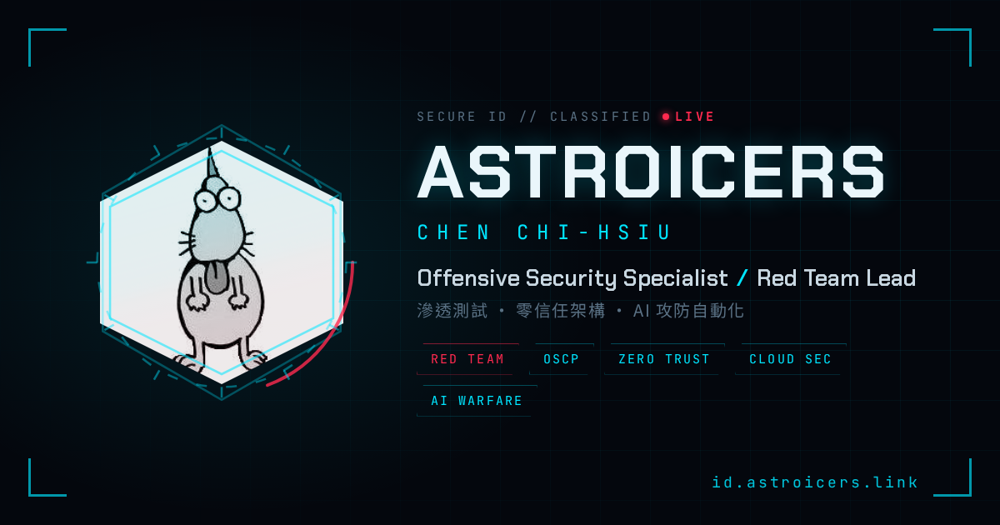

<div align="center">

# ASTROICERS // SECURE ID

**賽博龐克風格電子名片** — 單頁靜態 HTML，零 build，部署於 GitHub Pages。

[](https://id.astroicers.link)
[](LICENSE)

[](https://threejs.org)


<a href="https://id.astroicers.link">
  
</a>

🔗 線上版：**<https://id.astroicers.link>**

</div>

---

## 簡介

一張為資安工作者打造的賽博龐克風格電子名片：開機解密動畫、Three.js 3D 地形背景、文字解碼特效，可翻面顯示 QR Code、一鍵存入通訊錄（vCard），並支援 PWA 安裝與離線瀏覽。整體採用青／紅雙色 HUD 視覺，全部寫在單一 `index.html` 內，無框架、無 build 步驟。

## 功能特色

- 🖥️ **開機解密序列** — 進場模擬 mTLS handshake／身分解密的終端機 log 動畫。
- 🌐 **3D 賽博背景** — Three.js 即時渲染無限滾動線框地形、漂浮粒子與旋轉幾何核心，並隨滑鼠視差。
- 🔤 **文字解碼特效** — 姓名以亂碼 scramble 動畫還原，hover 可重播。
- 🪪 **賽博頭像框** — 六邊形遮罩 + 旋轉 HUD 環 + 掃描線 + 青色雙色調（duotone）；無照片時顯示佔位剪影。
- 🔄 **翻面 QR** — 點擊翻面顯示 QR Code，掃描即開啟線上名片。
- 📇 **一鍵存通訊錄** — 直接下載 vCard（`.vcf`），匯入手機聯絡人。
- 📱 **PWA／離線** — 可安裝為獨立 App，Service Worker 快取核心資產，離線可開。
- ♿ **無障礙友善** — 支援 `prefers-reduced-motion` 自動關閉動畫；語意化標籤與鍵盤焦點樣式。
- 🔍 **SEO／社群分享** — 完整 Open Graph、Twitter Card、canonical 與 manifest meta。

## 技術棧

| 類別 | 使用 |
| --- | --- |
| 結構 | 純 HTML5（單檔 `index.html`） |
| 樣式 | 原生 CSS（clip-path、backdrop-filter、3D transform、`@media` 響應式） |
| 3D 背景 | [Three.js](https://threejs.org) r128 |
| 動畫 | [anime.js](https://animejs.com) 3.2.1 |
| QR | [qrcode-generator](https://github.com/kazuhikoarase/qrcode-generator) 1.4.4 |
| 字型 | Chakra Petch · JetBrains Mono · Noto Sans TC（Google Fonts） |
| PWA | Web App Manifest + Service Worker |
| 部署 | GitHub Pages + 自訂網域（CNAME） |

> 所有第三方函式庫皆以 CDN 載入，repo 本身不含 `node_modules`、無打包流程。

## 專案結構

```
namecard/
├── index.html          # 名片本體（HTML + CSS + JS 全在這）
├── 404.html            # 找不到頁面時的 fallback
├── sw.js               # Service Worker（PWA 離線快取）
├── site.webmanifest    # PWA manifest
├── CNAME               # 自訂網域：id.astroicers.link
├── assets/
│   ├── me.jpg          # 頭像（方形，建議 ≥320px）
│   ├── favicon.svg     # 站台圖示
│   ├── apple-touch-icon.png
│   ├── icon-192.png / icon-512.png / icon-maskable-512.png   # PWA 圖示
│   └── og.png          # 社群分享預覽圖（1200×630）
├── LICENSE
└── README.md
```

## 本地預覽

純靜態網站，任意 static server 即可。由於使用 Service Worker 與絕對路徑（`/assets/...`、`/sw.js`），請透過 HTTP 啟動而非直接開檔：

```bash
# 擇一
python3 -m http.server 8000
npx serve .
```

開啟 <http://localhost:8000>。

## 部署

已透過 **GitHub Pages** 自動部署：推上 `main` 後約一分鐘自動上線，無 build 步驟。

```bash
git add index.html && git commit -m "update: ..." && git push
```

- **自訂網域**：由 `CNAME`（`id.astroicers.link`）設定，需於 DNS 將該子網域指向 GitHub Pages。
- **快取更新**：改動資產後，記得更新 `sw.js` 內的快取版本字串，使用者才會抓到新版。

## 客製化

名片內容與行為集中在 `index.html` 的 `<script>` 設定區：

| 項目 | 位置 | 說明 |
| --- | --- | --- |
| 名字／職稱／標籤 | `<section id="front">` | 直接改 HTML 文字 |
| 頭像 | `AVATAR_URL` | 換圖：覆蓋 `assets/me.jpg`；`AVATAR_DUOTONE` 切換青色雙色調 |
| QR 內容 | `CARD_URL` / `QR_MODE` | `'url'` 編碼網址（推薦）或 `'vcard'` 直接編碼 vCard |
| 聯絡資訊 | `vcard` 陣列與 `<nav class="contacts">` | Email／GitHub／LinkedIn／Blog |
| 配色 | CSS `:root` 變數 | `--cyan`、`--red`、`--void` 等 |

## 授權

程式碼採 [MIT License](LICENSE) — 歡迎以此為範本打造你自己的名片。

> ⚠️ **個人素材不在授權範圍內**：`assets/me.jpg`（個人照片）、`assets/og.png`，以及名片內的姓名、職稱與聯絡資訊等個人身分內容，版權保留、請勿直接重用；fork 後請替換為你自己的資料。

---

<div align="center">
<sub>KILL CHAIN // RECON → EXPLOIT → DOMINATE</sub>
</div>
